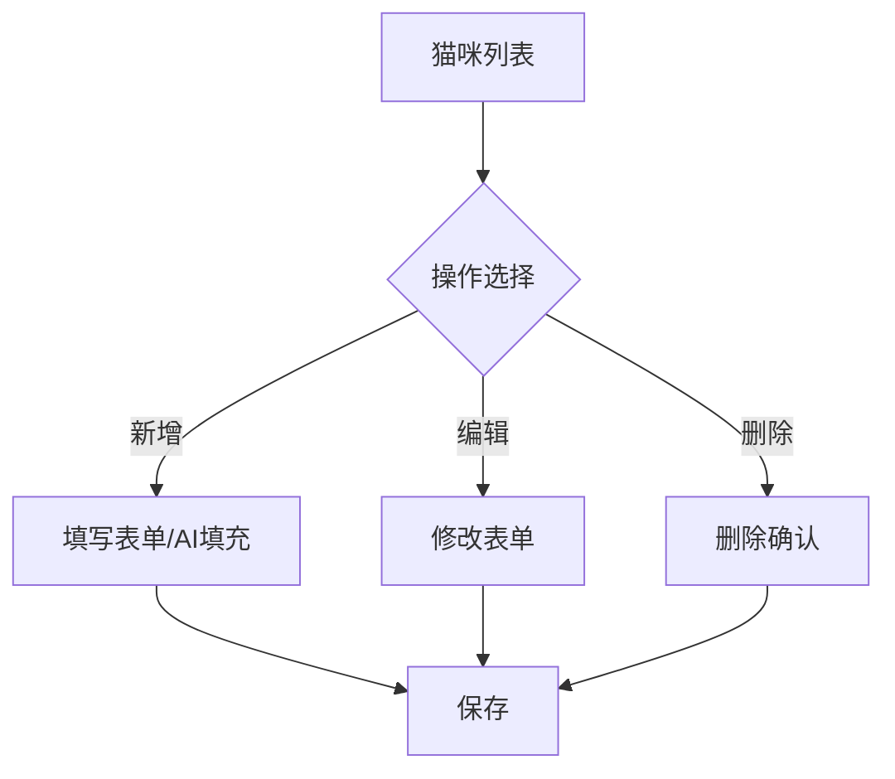
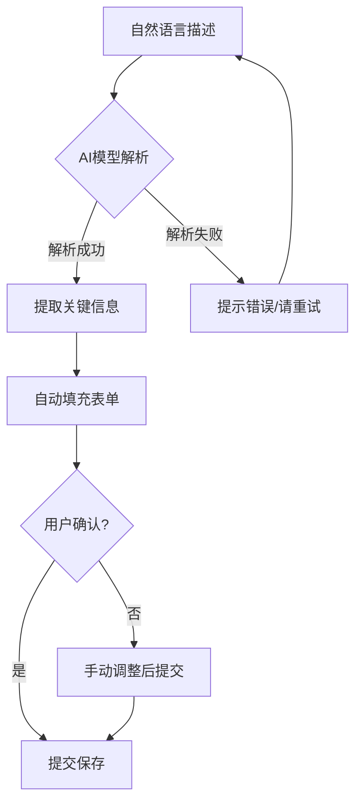
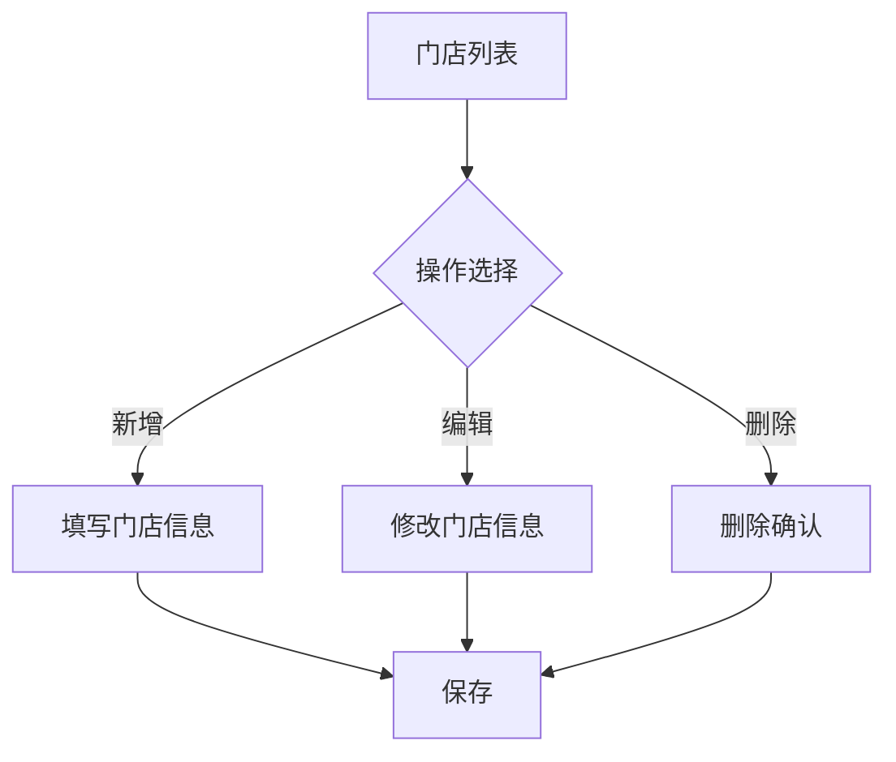
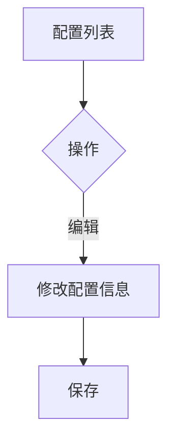

# 猫舍管理系统产品需求文档 (PRD)
# Cattery Management System - Product Requirements Document

**Document Version**: 1.1
**Date**: 2026-02-27
**Author**: Mr.Aloong

产品的需求范围与业务流程、史诗、用户故事，是一一对应，越来越细致的。

---

## 1. 项目背景 (Project Background)

猫舍（Cattery）在日常运营中面临管理效率和沟通效率低下的问题，同时猫舍需要向高端市场扩展：

对管理者（店长）：

- **手工记录繁琐**：依赖备忘录记录猫咪信息，手动打字较为麻烦
- **同步不及时**：猫咪信息无法实时同步给其他店员
- **检索困难**：无法快速按品种、门店、价格等多维度筛选猫咪

对客户（猫咪家长）：

- **信息获取繁琐**：每次都需要询问店主最新的在售猫咪信息、门店信息，以及上岗猫咪信息
- **卖家评价不直观**：难以获知真实售出的猫咪情况，即看不到卖家秀
- **挑选猫咪问价等待时间久**：店主（人工客服）不是24小时在线，无法时刻查看对比猫咪信息
- **计算售后服务价格不方便**：售后服务多样，取舍比价比较麻烦

---

## 2. 解决方案概述 (Solution Overview)

构建一套猫舍管理系统，包括基于 Web 的后台管理系统和基于小程序的店铺助手。

### 2.1 目标用户 (Target Users)

#### 主要用户 (Primary Users)

1. **店长 (Store Manager)**与**猫舍管理员 (Cattery Staff)**
   - 职责：管理猫咪信息、管理照片、管理门店信息

#### 次要用户 (Secondary Users)

2. **客户 (Customer Service)**
   - 需求：查询猫咪信息、查询门店信息

### 2.2 需求范围 (Requirements Scope)

对管理者：

- **统一管理猫咪**：集中管理所有猫咪信息，包括基础资料、品种、状态、照片
  - **AI 智能填充**：利用 AI 解析自然语言描述，自动提取并填充猫咪信息
- **管理门店**：管理门店信息，包括联系方式、营业时间、地址
- **管理配置**：管理配置属性，如猫咪品种、猫咪状态
- **管理卖家秀**：集中管理卖家秀猫咪信息
- **管理猫咪个性化信息**
- **管理价格计算器**

对客户：

- **查看猫咪详情**：查看在售猫咪列表和个性化信息，查看猫咖上岗猫咪列表
- **查看卖家秀**：查看已售优质猫咪照片、视频，了解真实的售出情况
- **价格计算器**：根据需要取舍售后服务（如疫苗、驱虫、绝育等），比较不同的付费方案

---

## 3. 业务场景 (Process Scenarios)

### 3.1 产品流程(Process)

#### 统一管理猫咪

##### 猫咪信息管理

##### AI智能填充

#### 管理门店

#### 管理配置

### 3.2 功能性需求(Functional Requirements)

#### 史诗-001：猫咪库存管理

猫咪库存管理

##### US-001: 登记猫咪
**作为** 猫舍管理员
**我想要** 快速登记新猫咪的信息
**以便** 系统化管理所有猫咪信息

**验收标准**:

- [ ] 支持手动填写表单
- [ ] 支持 AI 智能填充（自然语言解析）
- [ ] 必填字段验证（品种）
- [ ] 可选字段：名称、生日、价格、照片、描述、状态
- [ ] 照片上传支持
- [ ] 保存成功后显示成功提示

**优先级**: P0（必须实现）

---

##### US-002: 查看猫咪列表
**作为** 猫舍管理员
**我想要** 查看所有猫咪的列表
**以便** 快速了解库存情况

**验收标准**:

- [ ] 表格展示所有猫咪信息
- [ ] 支持分页（默认 10 条/页）
- [ ] 支持按列排序
- [ ] 支持按门店、品种、状态筛选
- [ ] 显示缩略图
- [ ] 点击行查看详情

**优先级**: P0

---

##### US-003: 编辑猫咪信息
**作为** 猫舍管理员
**我想要** 修改猫咪的信息
**以便** 保持数据最新（如状态变化、价格调整）

**验收标准**:
- [ ] 支持编辑所有字段
- [ ] 显示历史数据对比
- [ ] 保存前验证数据
- [ ] 记录修改时间和操作人

**优先级**: P0

---

##### US-004: 删除猫咪档案
**作为** 猫舍管理员
**我想要** 删除已售出或去世的猫咪档案
**以便** 保持数据整洁

**验收标准**:
- [ ] 删除前二次确认
- [ ] 支持批量删除
- [ ] 软删除（保留在数据库，标记为删除）
- [ ] 删除操作日志记录

**优先级**: P0

---

##### US-005: AI 智能填充
**作为** 猫舍管理员
**我想要** 用一句话描述猫咪，系统自动填充表单
**以便** 节省录入时间

**验收标准**:
- [ ] 支持自然语言输入（中文）
- [ ] 自动识别：品种、性别、年龄、价格、状态
- [ ] 显示解析结果，允许手动调整
- [ ] 解析失败时给出友好提示
- [ ] 支持从剪贴板自动读取

**优先级**: P1（重要功能）

---

##### US-006: 批量管理猫咪
**作为** 猫舍管理员
**我想要** 批量管理猫咪数据
**以便** 快速修改猫咪数据

**验收标准**:

- [ ] 支持批量修改猫咪状态
- [ ] 支持批量删除猫咪

**优先级**: P1

---

##### US-007: 数据导出
**作为** 猫舍管理员
**我想要** 导出猫咪数据到 Excel
**以便** 离线分析或分享

**验收标准**:
- [ ] 支持导出当前筛选结果
- [ ] 支持自定义导出字段
- [ ] 包含照片链接或缩略图
- [ ] 导出文件命名规范

**优先级**: P1

---

##### US-008: 上传猫咪照片
**作为** 猫舍管理员
**我想要** 为猫咪上传照片
**以便** 展示猫咪外观给客户

**验收标准**:
- [ ] 支持单图上传
- [ ] 支持多图上传
- [ ] 支持照片预览
- [ ] 支持删除照片
- [ ] 支持拖拽排序

**优先级**: P0

---
#### 史诗-002：门店管理

门店管理

##### US-009: 创建门店
**作为** 猫舍管理员
**我想要** 添加新的门店信息
**以便** 统一管理所有门店

**验收标准**:
- [ ] 支持填写门店名称
- [ ] 支持填写联系方式（电话、微信）
- [ ] 支持填写营业时间
- [ ] 支持填写地址信息
- [ ] 保存成功后显示成功提示

**优先级**: P0

---

##### US-010: 查看门店列表
**作为** 猫舍管理员
**我想要** 查看所有门店的列表
**以便** 快速了解门店分布

**验收标准**:
- [ ] 表格展示所有门店信息
- [ ] 支持按名称搜索
- [ ] 显示门店联系方式、地址

**优先级**: P0

---

##### US-011: 编辑门店信息
**作为** 猫舍管理员
**我想要** 修改门店的信息
**以便** 保持数据最新（如联系方式变更、营业时间调整）

**验收标准**:
- [ ] 支持编辑所有字段
- [ ] 保存前验证数据
- [ ] 保存成功后显示成功提示

**优先级**: P0

---

##### US-012: 删除门店
**作为** 猫舍管理员
**我想要** 删除不再运营的门店
**以便** 保持数据整洁

**验收标准**:
- [ ] 删除前二次确认
- [ ] 软删除（保留在数据库，标记为删除）

**优先级**: P1

---

#### 史诗-003：配置管理

猫咪库存管理

##### US-013: 品种管理
**作为** 猫舍管理员
**我想要** 动态添加猫咪品种
**以便** 系统支持所有品种

**验收标准**:
- [ ] 可以添加新品种
- [ ] 品种列表自动更新到下拉菜单
- [ ] 支持编辑和删除品种
- [ ] 支持品种排序

**优先级**: P1

---

##### US-014: 状态管理
**作为** 猫舍管理员
**我想要** 动态管理猫咪的状态枚举值
**以便** 灵活定义猫咪的状态

**验收标准**:

- [ ] 可以添加新状态
- [ ] 状态列表自动更新到下拉菜单
- [ ] 支持编辑和删除状态
- [ ] 支持状态排序

**优先级**: P1

---

### 3.3 功能需求矩阵 (Functional Requirements Matrix)

| ID | 需求描述 | 优先级 | 状态 | 备注 |
|----|----------|--------|------|------|
| FR-001 | 猫咪 CRUD | P0 | 📋 | 创建、读取、更新、删除 |
| FR-002 | 猫咪列表展示 | P0 | 📋 | 分页、排序、筛选 |
| FR-003 | AI 智能填充 | P1 | 📋 | 智谱 AI |
| FR-004 | 照片上传 | P0 | 📋 | 单图/多图上传、预览、删除 |
| FR-005 | 数据导出 | P1 | 📋 | Excel 导出 |
| FR-006 | 门店 CRUD | P0 | 📋 | 创建、读取、更新、删除 |
| FR-007 | 门店列表展示 | P0 | 📋 | 分页、搜索 |
| FR-008 | 品种管理 | P1 | 📋 | 动态添加、编辑、删除 |
| FR-009 | 状态管理 | P1 | 📋 | 动态添加、编辑、删除 |
| FR-010 | 批量导入 | P1 | 📋 | Excel/CSV 导入 |

---

### 3.4 非功能性需求 (Non-Functional Requirements)

#### 性能 (Performance)
| 指标 | 目标 | 测量方法 |
|------|------|----------|
| 页面加载时间 | < 2s | LCP (Largest Contentful Paint) |
| API 响应时间 (P95) | < 500ms | API 监控 |
| 表格渲染时间 | < 100ms | React DevTools Profiler |
| AI 解析时间 | < 5s | 智谱 API 响应时间 |

#### 可扩展性 (Scalability)
- 支持 10,000+ 猫咪记录
- 支持 100+ 并发用户
- 支持新增门店无需修改代码

#### 安全性 (Security)
- JWT 认证
- HTTPS 通信
- SQL 注入防护
- XSS 防护
- CSRF 防护
- 敏感数据加密（密码、API Key）

#### 可用性 (Usability)
- 响应式设计（桌面、平板）
- 无障碍访问（ARIA 标准）
- 中英文双语支持
- 友好的错误提示

#### 可维护性 (Maintainability)
- TypeScript 类型安全
- ESLint + Prettier 代码规范
- 组件化设计
- API 文档（OpenAPI/Swagger）

## 4. 实施计划 (Implementation Plan)

|      |      |
| ---- | ---- |
|      |      |
|      |      |
|      |      |

---

## 5. 风险与缓解策略 (Risks & Mitigations)

| 风险 | 概率 | 影响 | 缓解策略 |
|------|------|------|----------|
| AI 解析准确率不足 | 中 | 高 | 收集真实数据训练模型；提供手动调整入口 |
| API 性能问题 | 中 | 中 | 实现分页；添加缓存；数据库索引优化 |
| 数据迁移困难 | 低 | 高 | 提供批量导入功能；编写迁移脚本 |
| 用户采纳度低 | 中 | 高 | 培训和文档；收集反馈快速迭代 |
| 第三方依赖不稳定 | 低 | 中 | 智谱 AI 降级方案；API 限流处理 |
| 数据安全问题 | 低 | 高 | HTTPS；定期备份；权限控制 |

---

## 6. 变更历史

| 版本 | 日期 | 作者 | 变更说明 |
|------|------|------|----------|
| 1.0 | 2026-02-23 | Mr.Aloong | 初始版本 |
| 1.1 | 2026-02-27 | Mr.Aloong | 简化了大纲，提供了已实现的需求描述 |

